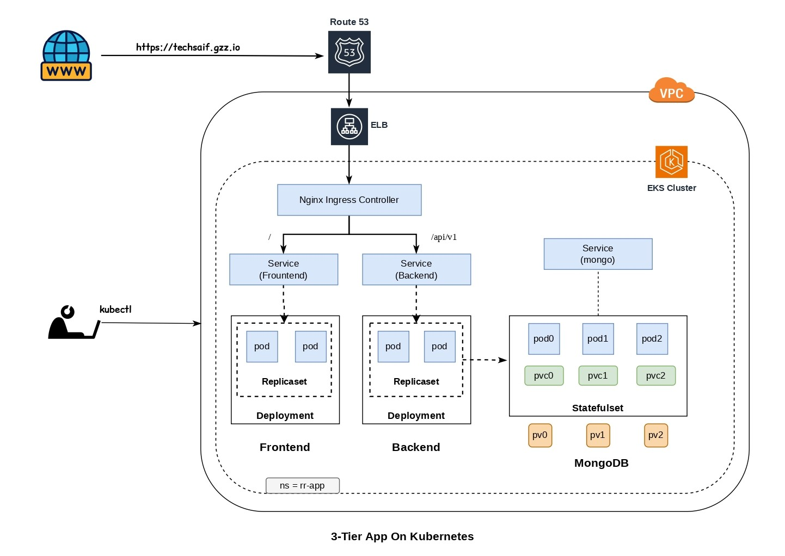

# 3 Tier App On Kubernetes
## Project Overview
- This Repository demonstrates deployment and management of a 3-tier application architecture on Amazon EKS.

**Technical Stack:**
- **Frontend:** The frontend of this application is built using React and JavaScript. It provides a responsive and user-friendly interface.
- **Backend and API:** The backend of this application is powered by Nodejs. It serves as the API handling user requests. MongoDB is used as the database backend, configured with a replica set for data redundancy and high availability.

## Architecture Diagram
<p align="center">
  
</p>

---

## Repo Structure

```bash
3-Tier_App_On_Kubernetes/

├── app/                             # Application workloads
│   ├── namespace.yaml
│   │
│   ├── frontend/
│   │   ├── frontend-deployment.yaml
│   │   ├── ingress.yaml
│   │   └── hpa-backend.yaml
│   │
│   └── backend/
│       ├── backend-deployment.yaml
│       └── hpa-frontend.yaml
│
├── database/                        # Stateful components
│   ├── mongo-statefulset.yaml
│   └── mongo-secret.yaml
│
├── external/                        # Third-party installations
│   ├── EBS_CSI_Driver.md
│   ├── cluster-autoscaler.md                      
│   ├── ingress-&-cert-manager.md
│   └── metrics-server.md
│
└── README.md
```
  
---
## Task 1: Setup Infra
1. **Create EKS Cluster**- (external/Create-EKS-Cluster.md)
2. **Install NGINX Ingress Controller** - (external/ingress-nginx.md)
3. **Install Cert-manager** - (external/cert-manager.md)
4. **Deploy Metrics Server** - (external/metrics-server.md)
5. **Installation and Setup EBS CSI Driver** - (external/EBS_CSI_Driver.md)
6.  **Setup Cluster autoscaler** - (external/cluster-autoscaler.md)
---

## Task 2: Deploy Database, Backend and Frontend
### Step 1 - **Create namespace (rr-app):**

```bash
kubectl apply -f namespace.yaml
kubectl get ns
```

### Step 2 - **Deploy database (mongodb):**

```bash
kubectl apply -f mongo-secret.yaml
kubectl apply -f mongo-statefulset.yaml
```

**Verify:**

```bash
kubectl get pods -n rr-app
kubectl get svc -n rr-app
kubectl get all -n rr-app
kubectl get pv
kubectl get pvc -n rr-app
kubectl config set-context --current --namespace rr-app  # set default namespace as rr-app
```
### Step 3 - Initialize Replica Set First

```bash
kubectl exec -it mongo-0 -n rr-app -- mongo
```

**Run:**

```sql
rs.initiate({
  _id: "rs0",
  members: [
    { _id: 0, host: "mongo-0.mongo-svc:27017" },
    { _id: 1, host: "mongo-1.mongo-svc:27017" },
    { _id: 2, host: "mongo-2.mongo-svc:27017" }
  ]
})
```

Wait few seconds.

**Verify:**

```bash
rs.status()
```
**Ensure mongo-0 becomes PRIMARY.**

### Step 4 - Execute **init.js**   (From your local machine:)

```bash
kubectl exec -i mongo-0 -n rr-app -- mongo < init.js
```

### Step 5 - Verify Data

**Open mongo shell:**

```bash
kubectl exec -it mongo-0 -n rr-app -- mongo
```
**Switch DB:**

```bash
use restaurant_reviews
```

**Check collections:**

```bash
show collections
```
**Check data:**

```bash
db.restaurants.find().pretty()
```
**Check reviews:**

```bash
db.reviews.find().pretty()
```
---
**Check (mongo-1 secondry receives replicated data)**

```bash
kubectl exec -it mongo-1 -n rr-app -- mongo   
```
**Switch DB:**

```bash
use restaurant_reviews
```
**Enable reads:**

```bash
rs.slaveOk()
```
**Check collections:**

```bash
show collections
```
---
### Step 6: Deploy Application (backend and frontend)

**backend**
```bash
cd app/backend/
kubectl apply -f backend-deployment.yaml
kubectl apply -f hpa-backend.yaml
```

**frontend**
```bash
cd app/frontend/
kubectl apply -f frontend-deployment.yaml
kubectl apply -f hpa-frontend.yaml
kubectl apply -f ingress.yaml
```

Verify:

```bash
kubectl get pods -A
kubectl get svc -A
kubectl get ingress -A
```
